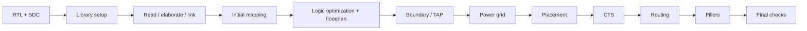

# RISC-V ASIC Physical Design — SAED14 / Synopsys Fusion Compiler

A complete academic **RTL-to-routed physical-design implementation** of a RISC-V core using **Synopsys Fusion Compiler** and the **SAED 14 nm educational PDK**.

The course supplied the RTL, SDC and a small set of helper scripts. My work focused on building and automating the implementation flow around those inputs: library setup, synthesis, floorplanning, power planning, placement, CTS, routing, filler insertion, physical checks and result analysis.

> **Source ownership:** Course-provided RTL, SDC, helper scripts and PDK collateral are intentionally **not redistributed**. See [`docs/source_provenance.md`](docs/source_provenance.md).

## Final results

| Metric | Result |
|---|---:|
| Clock target | **100 MHz (10.00 ns)** |
| Final setup WNS (`clk_i`) | **+6.98 ns** |
| Setup TNS / violating paths | **0.00 ns / 0** |
| Worst detailed hold slack | **+0.03 ns** |
| Worst reported clock skew | **70 ps** |
| Placement utilization | **59.15%** |
| Leaf cells | **11,797** |
| Netlist cell area | **6,532.93** |
| Open nets | **0** |
| Routing DRC violations | **0** |
| Placement legality violations | **0** |
| PG DRC | **No errors found** |
| Floating PG connections | **0** |

Power estimate from the final propagated-activity report: **0.498 mW dynamic + 0.169 mW leakage** at the report condition of **0.71 V / 125 °C**. See [`docs/results.md`](docs/results.md) for context and limitations.

## Flow



The implementation is checkpointed after each major stage, making it easy to compare timing, area and cell-count evolution throughout the flow.

## Optimization progression

| Stage | Setup WNS (`clk_i`) | Leaf cells | Cell area |
|---|---:|---:|---:|
| Initial mapping | +6.33 ns | 11,837 | 6,399.37 |
| Logic optimization / floorplan | +7.77 ns | 11,539 | 6,553.93 |
| Placement | +6.88 ns | 11,781 | 6,452.52 |
| CTS | +6.91 ns | 11,797 | 6,528.80 |
| Routing / final | **+6.98 ns** | **11,797** | **6,532.93** |

## Repository structure

```text
RISC-V-ASIC-Physical-Design/
├── README.md
├── NOTICE.md
├── .gitignore
├── config/
│   └── project_setup.tcl
├── scripts/
│   ├── 00_build_lib.tcl
│   ├── 01_read_rtl_sdc.tcl
│   ├── 02_initial_synthesis.tcl
│   ├── 03_logic_opto_floorplan.tcl
│   ├── 04_boundary_tap.tcl
│   ├── 04a_power_grid.tcl
│   ├── 05_place_opt.tcl
│   ├── 06_clock_opt.tcl
│   ├── 07_route.tcl
│   ├── 08_filler.tcl
│   └── 09_final_status.tcl
├── reports/
│   ├── stage_qor/
│   └── selected final reports
├── docs/
│   ├── flow.md
│   ├── results.md
│   ├── implementation_notes.md
│   └── source_provenance.md
├── rtl/
│   └── README.md
├── constraints/
│   └── README.md
└── course_assets/
    └── README.md
```

## Implementation highlights

- Built the Fusion Compiler design library with **LVT/RVT/HVT** SAED14 references and **CMIN/CMAX TLU+** parasitic technology.
- Used a **60% target core utilization** with a square automatic floorplan and explicit signal/clock pin-layer constraints.
- Implemented a multi-layer PG topology in the submitted run using **M1 rails, M5/M6/M7 straps and an M6/M7 ring**.
- Ran high-effort placement and congestion optimization.
- Performed **Clock Tree Synthesis** with propagated-clock timing and skew analysis.
- Completed automatic routing and route optimization, followed by route, PG, legality, timing, area and power checks.
- Finished with **0 open nets, 0 routing DRC violations and 0 PG connectivity failures** in the supplied final reports.

## Reports worth opening

For a quick review, start with:

- [`reports/final_qor.rpt`](reports/final_qor.rpt)
- [`reports/final_clock_skew.rpt`](reports/final_clock_skew.rpt)
- [`reports/final_route_check.rpt`](reports/final_route_check.rpt)
- [`reports/final_pg_connectivity.rpt`](reports/final_pg_connectivity.rpt)
- [`reports/final_pg_drc.rpt`](reports/final_pg_drc.rpt)
- [`reports/place_utilization.rpt`](reports/place_utilization.rpt)

## Reproducing the flow

This repository is intentionally not self-contained because the course RTL/SDC/helpers and SAED14 PDK are not redistributed. In an authorized environment:

```bash
export PROJECT_ROOT=/path/to/clone
export SAED14_ROOT=/path/to/SAED14_EDK
export COURSE_ASSETS_DIR=/path/to/course/helpers
```

Place authorized local copies of the RTL and SDC under `rtl/` and `constraints/`, then execute the Tcl stages in order from Fusion Compiler.

## Verification limitation

The final routing report states that **no antenna rules were defined**, so antenna analysis was skipped. The project therefore claims clean results only for the checks actually present in the reports (timing, opens, routing DRC, PG DRC/connectivity and placement legality), not full foundry signoff.
